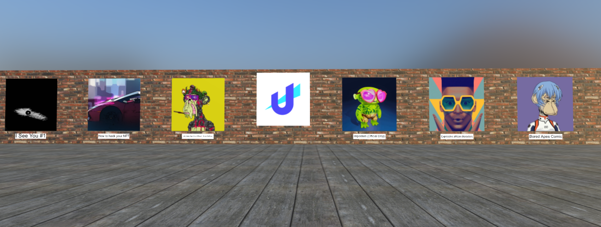
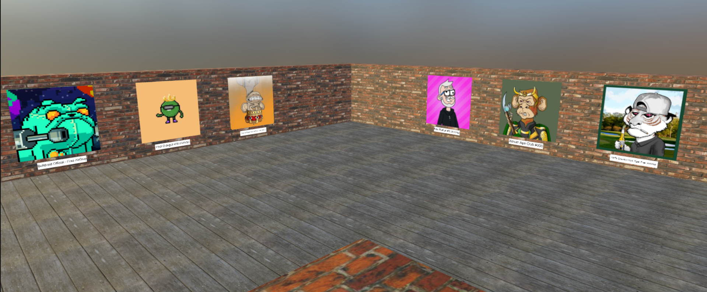

# NFT gallery with Unstoppable Domains Login

3D NFT gallery for view your NFT collections on Polygon Mainnet *

------

<i> * - Currently supports only two collections: [OpenSea Collections](https://polygonscan.com/token/0x2953399124f0cbb46d2cbacd8a89cf0599974963) & [Unstoppable Domains - (Polygon)](https://polygonscan.com/token/0xa9a6a3626993d487d2dbda3173cf58ca1a9d9e9f)</i>

**Will be added more collections soon**

------------

- **Video demo:** [https://www.youtube.com/watch?v=h_ZvAfhbqHU](https://www.youtube.com/watch?v=h_ZvAfhbqHU)
- **Live demo website:** [https://nft-3d-gallery.netlify.app/](https://nft-3d-gallery.netlify.app/)

--------

**Stack:**

- Babylon js
- UD Login with Unstoppable
- Alchemy
- React

--------

**How to run app:**

Rename `.env.example` file to `.env` and complete all fields:

- `PORT` - port of your app
- `REACT_APP_ALCHEMY_KEY` - you can get a key here https://www.alchemy.com/
- `REACT_APP_UD_CLIENT_ID` & `REACT_APP_UD_REDIRECT_URI` -  your client credentials. You can create new client here https://dashboard.auth.unstoppabledomains.com/

After, run `yarn install` command to install all packages and `yarn start` to start your application local.

-------

